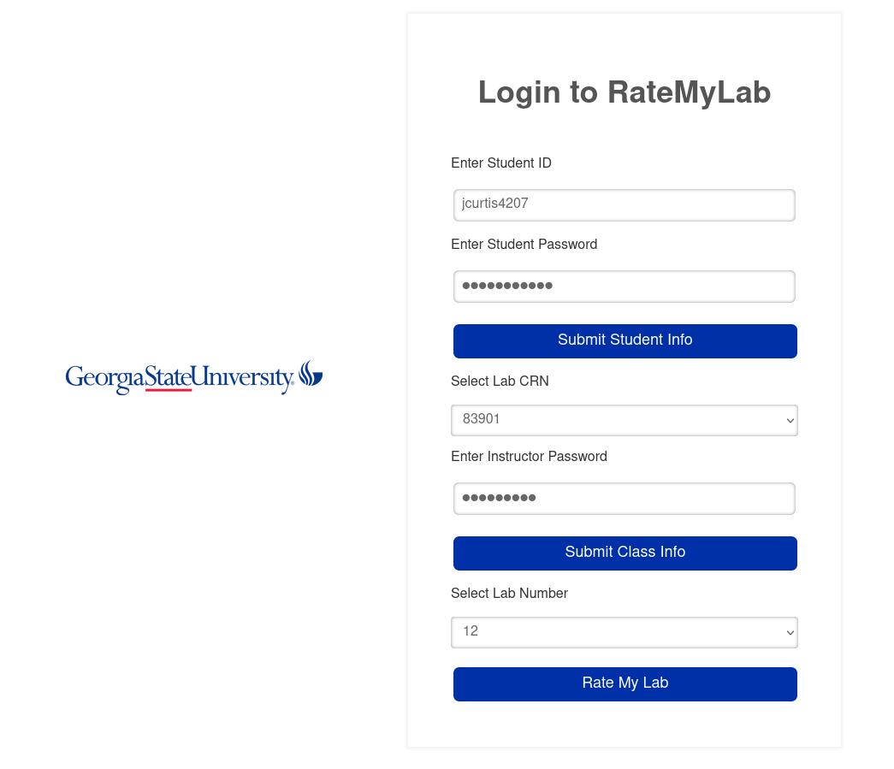
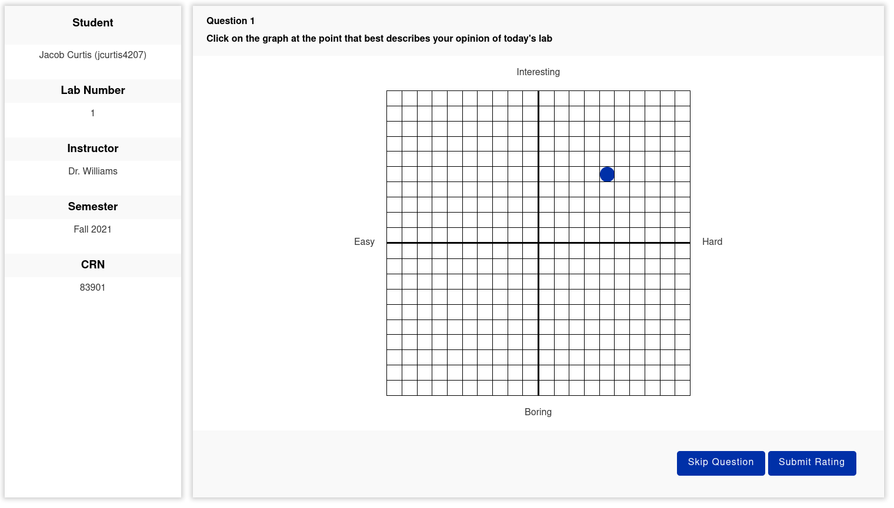

# StudentUI

## RateMyLab

RateMyLab was the semester project for GSU Software Engineering Fall 2020.

The purpose of the project was to create a web-based application for students to rate lab questions based on difficulty and interest level. 

The data would be stored in a MySQL database, and the data could then be used by professors to gauge the appropriateness of the lab questions.

Our team, The Garbage Collectors, were tasked with creating the Student interface.

The interface was written in HTML, CSS, JavaScript, and PHP. 

The two main aspects of the student interface were the login procedure and the rating procedure. 

#

### Logging In

When the semester begins, each student will receive a temporary password good for the first login. 

By logging in with this password, the student will be taken to a new screen and prompted to create 
a new password.

Subsequent logins will require use of the newly created password, as well as the instructor password 
for the particular class section the student is enrolled in.

With all of the correct login information entered, the student will select the current lab number, and 
this will take them to the rating screen.

#

### Rating Labs

The rating page uses a clickable grid with interest on one axis and difficulty on the other. 

Information about the student, instructor, and lab are shown on the left side of the screen. 

The student will either click a square on the grid, or opt to skip the rating. 

#

### Backend

The backend of the rating system uses a MySQL database created by the Database Team. 

Interaction with the JavaScript frontend calls PHP functions.

The PHP code interfaces with the database, either pulling information about the student and lab, 
or pushing information about the ratings or password changes. 

